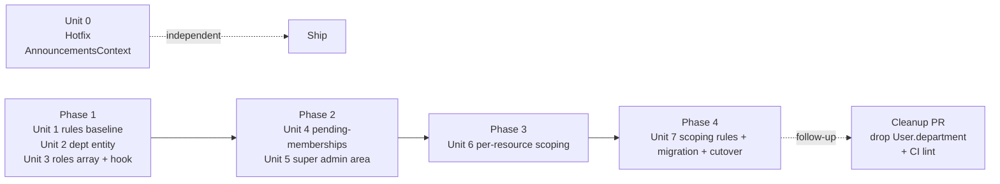

# Multi-Department Support

## Overview

Promote `department` from scattered strings to a first-class entity. Introduce `super_admin` above department admins. Scope admins to a single department, keep faculty joint-appointment-capable, keep students + research visibility global. Migrate ECE/CISE/MAE in place behind a short, pre-announced maintenance window.

**This plan is right-sized for ~3–5 UF departments, not enterprise multi-tenancy.** Role storage uses a single-field `users/{uid}.roles[]` array read via one `get()` in rules (well inside Firestore's 10-`get()` budget) — no Firebase custom claims, no token-refresh markers, no `checkRevoked=true` propagation. Super admin oversight is a scoped view under the super admin's real session — no custom-token preview, no rules `readOnly` conjunction. Faculty invites use a `pendingMemberships/{email}` record resolved on first sign-in — no signed tokens, no 72h/6h TTL mismatch, no antivirus-prefetch failure mode. If scale pressure changes (external institutions, >20 departments, audit compliance), revisit these simplifications.

Work is delivered in 4 phases plus one independent hotfix: baseline Firestore rules + department entity + roles-array model; pending-memberships invites + Super Admin Departments area; per-resource scoping (courses, applications, research, announcements); scoped rules + backfill + cutover.

## Problem Frame

Three departments (ECE, CISE, MAE) use the app today; 1–2 more are in active conversation. Onboarding a new department today requires code changes (hardcoded union type `'ECE'|'CISE'|'MAE'` at `src/types/announcement.ts:2`, `department: 'ECE'` default at `src/app/admincourses/page.tsx:279`, `userDepartment = 'ECE'` at `src/contexts/AnnouncementsContext.tsx:113` that mis-targets every CISE/MAE user as ECE today). There is no role above admin and no non-engineering path to create a department. There are no deployed Firestore security rules — production access is client-checks only. (See origin: `docs/brainstorms/multi-department-support-requirements.md`.)

## Requirements Trace

**Data model & roles:**

- **R1** Department as first-class entity created in-app (origin §Goals)
- **R2** `super_admin` role with sole authority to create departments (origin §Super admin model)
- **R3** Admin authority scoped to a single department (origin §Goals)
- **R4** Cross-department research (authed read, dept-scoped write) + flexible super-admin announcements (origin §Cross-department scope rules)

**Onboarding:**

- **R5** Admin and faculty invited by email; invite is time-bounded, single-use, and bound to the invited email (origin §Invite links) — **satisfied by a pending-memberships record resolved on first sign-in**, not a signed-token URL

**Migration & rules:**

- **R6** Migrate ECE/CISE/MAE behind a single pre-announced maintenance window (≤30 min) — preserves joint-appointment faculty — no silent data drops (origin §Migration, revised from "no user-visible disruption" to match reality)
- **R7** Prerequisite Firestore rules baseline before dept-scoping rules ship (origin §Prerequisite)

**Super admin:**

- **R8** Super admin can view any department's admin dashboard under their real session — writes are permitted (super admin authority is global) but the scope indicator is visually unambiguous (origin §Super admin model — revised: "read-only preview" is replaced with "scoped view" since super admin already has global write authority)
- **R9** Reversible archival: archived dept hides from new-application/new-invite pickers, existing admins lose admin nav, faculty retain read-only, students keep their history (origin §Department entity)
- **R10** Success criteria (§Success criteria below)

## Scope Boundaries

- Multi-institution/multi-university tenancy, SSO, per-dept branding, per-dept billing, audit-log UI, permission-based access control (origin §Non-goals).
- **Multi-department admin** — single-dept admin only this pass.
- **Course reassignment between departments** as an admin operation — courses stay in their created department.
- **Cross-listed courses** — a course that belongs to two departments is listed as two records in v1.
- **Firebase custom claims** — deliberately out. At ~3–5 departments with ≤5 memberships per user, a single `get(/users/{uid})` per rule evaluation is well under the 10-`get()` budget. Adopting custom claims adds a 1000-byte JWT budget to enforce, a `tokenRefreshAt` marker subscription, `getIdToken(true)` plumbing, a claim-rebuild Cloud Function, and a ~1h revocation lag — complexity with no scale payoff here. Revisit only if observed rule-eval cost or user-base growth justifies it.
- **Custom-token read-only impersonation** — deliberately out. Replaced by a simpler "scoped view" where super admin browses any department's data under their real session. The original design's central guarantee (super admin can't accidentally write) protects against a threat that doesn't exist — super admin has global write authority by design. Also: `signInWithCustomToken` destroys the current session (only one `currentUser` per Auth instance), so the "preserved real session" approach doesn't actually work.
- **Signed-token URL invites** — deliberately out. Replaced by `pendingMemberships/{email}` records materialized on first UF sign-in. Eliminates: 72h TTL vs Firebase email-link's 6h embedded oobCode mismatch, antivirus-prefetch burning the oobCode, secret hashing in Firestore, invite state machine, resend/revoke UI, and a new Cloud Function surface.
- **Firebase compat → modular SDK migration** — stays on compat.
- **`roles_audit` / audit collections** — no current consumer; no rule written. Add in a follow-up if compliance requires.
- **Reconciliation UI as a new routed page** — a migration CLI that emits a CSV of no-signal users to resolve via the existing `/users` admin page is sufficient for one-time cutover.

### Deferred to Separate Tasks

- **Drop `User.department` field and legacy hardcoded strings** — lands one release after this plan; dual-write mirror is live until then.
- **CI lint for `'ECE'` / `'CISE'` / `'MAE'` regressions** — ships with the cleanup PR.
- **Scheduled-announcement dispatcher** (Cloud Function to dispatch `scheduledAt`-past announcements) — out of scope; current client-triggered dispatch + audience snapshot at submit is sufficient.

## Context & Research

### Relevant Code and Patterns

- `src/firebase/auth/auth_context.js` — `AuthProvider`; route gate; stores only Firebase Auth user, not role.
- `src/firebase/util/GetUserRole.js` — `useDocument` hook reading `users/{uid}.role`. The single most-called gate; 10+ importers + 16 `role ===` sites.
- `src/firebase/functions/callFunction.ts` — client-side Cloud Function invocation via `fetch` + Bearer `Authorization` header (HTTP `onRequest`, not `onCall`). Base URL overridable via `NEXT_PUBLIC_FUNCTIONS_BASE_URL`.
- `functions/src/index.ts` — every Cloud Function is `onRequest`. Manual `verifyIdToken()` at ~line 136. `getRole(uid)` + `ensureStaffRole` are the current server-side role gates.
- `functions/src/nodemailer.ts` — 10 plain-text email builders over Gmail SMTP (env `EMAIL`/`EMAIL_PASS`). `sendEmail` Cloud Function dispatches by `type`.
- `src/constants/research.ts` — `DEPARTMENTS` list with 10 entries (canonical source to reconcile against signup's 7 and announcements' 3).
- `src/app/admincourses/page.tsx:279` — hardcoded `department: 'ECE'`; xlsx writes to `semesters/{semester}/courses/{Course:Instructor}`.
- `src/contexts/AnnouncementsContext.tsx:113` — the `userDepartment = 'ECE'` production bug addressed independently by Unit 0.
- `src/app/announcements/AnnouncementDialogue.tsx:65` — hardcoded `departmentOptions = ['ECE', 'CISE', 'MAE']`.
- `src/hooks/Announcements/usePostAnnouncement.ts:87` — `users.where('department', 'in', group)` for recipient counting; `generateTokens()` produces `dept:<code>` tokens.
- `src/scripts/migrateApplications.ts` — existing `--dry` / `--live` convention to mirror for every backfill.
- `src/hooks/useGetItems.ts` — `getNavItems(userRole)` giant switch; gains a `super_admin` branch.
- `functions/src/index.ts` `processCreateCourseForm` (flat `courses/{id}`) — likely dead code; audit and delete in Unit 6 rather than modify.
- `functions/src/index.ts` `processApplicationForm` (writes `applications/{type}/uid/{uid}` with **`courses` as a nested map**, not a subcollection) — the critical shape fact that drives the `departmentIds: string[]` field design in Unit 6.

### Institutional Learnings

- `docs/solutions/` does not yet exist. Seed after ship via `ce:compound` with learnings on: per-tenant roles via a single Firestore array, pending-memberships invites, expand→dual-write→backfill migrations, and the Firestore rules baseline/scoping sequencing.

### External References

- **Firestore rules:** `get()` cap is **10 per single-doc request** (20 for multi-doc); repeat `get()` on the same path is cached within one eval. One `get(/users/{uid})` in rules is cheap.
- **Firestore array queries:** `array-contains-any` limit is 30 values — fine for this scale.
- **BulkWriter (firebase-admin):** auto-ramps 500 qps +50%/5min, cursor-resumable via `stream()`, idempotent via stamp field.
- **firebase.json schema:** supports a `"firestore": { "rules": "firestore.rules", "indexes": "firestore.indexes.json" }` block. Rules deploy via `firebase deploy --only firestore:rules` — a server-side global operation with no client flag.
- Sources: Firestore rules docs (rules-conditions, rules-structure), Firestore data-model docs, Firebase rules unit-testing (`@firebase/rules-unit-testing`), firebase-admin BulkWriter API.

## Key Technical Decisions

- **Data model — subcollection where scope is pure + denormalized id on cross-dept docs.** `departments/{id}` is the tenant entity. `departments/{id}/courses/{id}` is a subcollection (rules trivially scope by parent path). Announcements stay flat (existing composite index on `audienceTokens` is load-bearing) with denormalized `departmentId` on the doc. Applications stay at `applications/{type}/uid/{uid}` with the existing `courses` nested map preserved; a new top-level `departmentIds: string[]` field is written by the Cloud Function to enable rules scoping and cross-dept admin queries.

- **Role storage — single array on the user doc.** `users/{uid}.roles: Array<{deptId: string, role: 'admin' | 'faculty'}>` + `users/{uid}.superAdmin: boolean`. Source of truth, read directly in rules via a single `get(/users/$(uid))`. No subcollection of record, no claim rebuild, no token refresh marker. Student status lives on application documents (per origin §Roles). A user with multi-signal migration data gets multiple role entries (joint appointments preserved).

- **Admin's active department is derived.** Admin users have exactly one `role === 'admin'` entry; `useCurrentUser()` exposes `activeDeptId` from it. No department picker.

- **Unified `useCurrentUser()` hook replaces `useAuth() + GetUserRole()`.** Returns `{ firebaseUser, roles, superAdmin, activeDeptId, loading, error }`. All 10+ existing `GetUserRole` importers + `role ===` sites consume it. Legacy `GetUserRole` stays as a thin shim until the cleanup PR.

- **Invite flow — pending-memberships materialized on first sign-in.** An admin creates `pendingMemberships/{emailLower}` with `{ deptId, role, invitedBy, invitedAt }`. A notification email goes via the existing nodemailer (new `sendInviteNotificationEmail` — "You've been added as faculty of CISE; sign in with your UF email to activate"). On the first `onCreate` of `users/{uid}` via `processSignUpForm`, or on every `useCurrentUser` load, a Cloud Function reads `pendingMemberships` for the user's email, materializes matching entries into `users/{uid}.roles[]`, and deletes the pending docs. Idempotent; resend = re-create the pending doc; revoke = delete the pending doc.

- **Audience snapshot materialized at schedule-submit.** Composer resolves "all departments" into concrete `dept:<id>` tokens at submit. Dispatch never re-resolves. Matches the current client-driven dispatch model and avoids the new-dept-between-schedule-and-dispatch race.

- **Token key = department id (canonical slug), not code.** Codes become rename-free display-only strings.

- **Super admin "scoped view" — no impersonation.** Super admin navigates to `/admin/departments/[id]` and every admin surface (courses, applications, announcements, members) renders the data scoped to that dept. Super admin acts under their own identity and full write authority; the page header shows the scope clearly. No custom-token swap, no 15-min TTL, no `readOnly` rule conjunction. Origin R8 ("read-only preview") is reinterpreted as "scoped view" — the product value (super admin can see what's happening in a department) is preserved; the artificial write-guard is dropped.

- **Baseline rules (Unit 1) are tight, not permissive.** Match what client code actually writes today: `users/{uid}` self-write only; `applications/{type}/uid/{uid}` only if `request.auth.uid == uid`; `semesters/{s}/courses/{c}` write only if caller has `role === 'admin'`; `research-listings/{id}` write only for the listing's author; `announcements/{id}` write only for `admin|faculty`; `faculty-stats/{id}` write only for admin. Under no scenario does the baseline allow "any authenticated user writes anything." This is closer to the actual current posture (default-deny client-code-gated) than the originally-planned permissive baseline.

- **Scoping rules (Unit 7) add departmental authority on top of the baseline.** `hasAdminOf(deptId)` and `hasFacultyOf(deptId)` helpers read `get(/users/$(uid)).data.roles` and check entries. Announcements write uses `hasOnly`-style subset check against the writer's authorized dept tokens — prevents a dept admin from forging `['all', 'dept:otherdept']`. Research writes require faculty or admin of the listing's `departmentId`.

- **`departmentIds` denormalized on `users/{uid}`.** Maintained by the role-write path. Enables rules to answer "can this admin read this user?" without a second `get()`. Also used by `usePostAnnouncement`'s recipient-count query during the mirror window.

- **Course reassignment — not supported v1.** Courses stay in their created department. Cross-listed courses = two records.

- **Applications resolve `departmentId` server-side at submit.** Server reads the course doc, writes `departmentIds: string[]` on the application doc (array, because one application can cover multiple courses across migrations).

- **Migration behind a ≤30 min pre-announced maintenance window.** Plan's promise is "scheduled + communicated disruption," not "no disruption" (R6 rewritten above). Dual-write `User.department` alongside the new `users/{uid}.roles[]` so a quick rollback (revert rules + code) leaves data usable. BulkWriter + `_backfillV` stamp for idempotency. CSV report of no-signal users emitted by the migration; super admin resolves those via the existing `/users` page before cutover is declared complete.

## Open Questions

### Resolved During Planning

- Data model shape: subcollection where scope is pure + denormalized id on cross-dept docs.
- Role storage: `users/{uid}.roles[]` array (not custom claims, not subcollection).
- Invite email mechanism: `pendingMemberships` record + notification email (not Firebase email-link, not signed tokens).
- Super admin "preview": scoped view under real session (not impersonation).
- Token key: department id, not short code.
- Course reassignment: out of scope.
- Application `departmentIds`: server-resolved at submit, top-level array on the application doc.
- Baseline rules posture: tight per-user/per-role, not "any authenticated user read/write all."

### Deferred to Implementation

- Exact pre-cutover maintenance-window length (depends on dry-run measurement).
- Announcement recipient-count query implementation during the mirror window (client uses `users.where('department', 'in', codes)` or `users.where('departmentIds', 'array-contains-any', ids)` — decide after the denormalization lands).
- Exact CSV columns of the no-signal reconciliation report.
- Whether faculty-stats gains `departmentId` denormalization (audit during Unit 6 discovery).
- `processCreateCourseForm` is likely dead — confirm no caller, then delete in Unit 6 rather than modify.

## High-Level Technical Design

> _These sketches illustrate intent. They are directional guidance for review, not implementation specification._

### Phase shape



### User role shape (pseudo-code)

```text
users/{uid}
    # legacy (dual-written during mirror window; dropped in cleanup PR)
    role: "admin" | "faculty" | "student" | "unapproved" | "student_*"
    department: string

    # new (source of truth for role gating after cutover)
    superAdmin: boolean
    roles: [{ deptId: string, role: "admin" | "faculty" }]
    departmentIds: string[]                       # denormalized, == roles.map(r => r.deptId)

# Pending membership that materializes on first sign-in
pendingMemberships/{emailLower}
    deptId: string
    role: "admin" | "faculty"
    invitedBy: string   # uid
    invitedAt: Timestamp
```

### Rule skeleton (illustrative)

```text
function user() { return get(/databases/$(database)/documents/users/$(request.auth.uid)).data; }
function isSuperAdmin() { return user().superAdmin == true; }
function hasAdminOf(deptId) {
  return deptId in user().departmentIds
      && user().roles[<matching index>].role == 'admin';
  # In practice: use a boolean helper on the user doc (e.g. adminOfDepartmentIds: string[]) to
  # avoid the array-index dance. Planning-time pseudo-code; actual rule uses hasAny() over denormalized fields.
}

match /departments/{deptId}/courses/{cid} {
  allow read: if request.auth != null;
  allow write: if isSuperAdmin() || hasAdminOf(deptId);
}

match /announcements/{id} {
  allow read: if request.auth != null;
  allow write: if isSuperAdmin()
            || (request.resource.data.audienceTokens.hasOnly(writerAuthorizedTokens())
                && request.resource.data.departmentId in user().adminOfDepartmentIds);
}
```

**Note:** the real rule file uses two denormalized helper fields on the user doc — `adminOfDepartmentIds: string[]` and `facultyOfDepartmentIds: string[]` — maintained by the role-write path. They let rules check membership with `hasAny`/`in` without iterating the richer `roles[]` array. One `get()` per eval regardless.

## Implementation Units

### Unit 0 (independent hotfix, ships today)

- [ ] **Unit 0: AnnouncementsContext hardcode fix**

**Goal:** Eliminate the production bug where `src/contexts/AnnouncementsContext.tsx:113` hardcodes `userDepartment = 'ECE'` for every user, mis-targeting announcements for every CISE and MAE user as ECE. Ships as an independent PR **today**, completely decoupled from the multi-dept work.

**Requirements:** None directly — it's a bug fix. Addresses the "High" risk in origin §Risks table.

**Dependencies:** None.

**Files:**

- Modify: `src/contexts/AnnouncementsContext.tsx` (derive `userDepartment` from `users/{uid}.department` via the existing `GetUserRole`-adjacent read, normalized via `isDepartmentMatch` from `src/constants/research.ts`; fall back to `'all'`-only token set if no dept)
- Test: `src/contexts/__tests__/AnnouncementsContext.test.tsx` (add cases for CISE user, MAE user, user with no department)

**Approach:**

- Read `users/{uid}.department` from the existing user doc subscription already present in the context. Map via `isDepartmentMatch` against the 10-entry `DEPARTMENTS` list in `src/constants/research.ts` to a canonical short code.
- If no match (unapproved user, malformed data), emit only `['all']` + role/user tokens.
- No new Firestore reads; uses existing subscription.

**Test scenarios:**

- Happy path: CISE user's token set includes `dept:CISE` (or whatever short code matches). ECE user's includes `dept:ECE`. MAE user's includes `dept:MAE`.
- Edge case: user with `department === 'CS'` (legacy signup dropdown value) resolves to CISE via `isDepartmentMatch`.
- Edge case: user with no department is not emitted a `dept:*` token.
- Integration: CISE user's announcement feed shows CISE-targeted announcements and does not show ECE-only announcements.

**Verification:** Deploy Unit 0 independently. Smoke test: log in as a CISE user; confirm ECE-only announcements no longer appear in the feed.

---

### Phase 1 — Foundation

- [ ] **Unit 1: Tight Firestore rules baseline**

**Goal:** Ship a deployable `firestore.rules` file and wire it into `firebase.json`. Rules match current client-side gating — self-only writes for user-owned data, role-based writes for admin surfaces — _not_ a permissive "any auth user" baseline. Posture equals or exceeds today's implicit default-deny.

**Requirements:** R7.

**Dependencies:** None. First in the plan.

**Files:**

- Create: `firestore.rules`
- Modify: `firebase.json` (add `"firestore": { "rules": "firestore.rules", "indexes": "firestore.indexes.json" }`)
- Create: `tests/rules/baseline.test.ts` (`@firebase/rules-unit-testing` harness)

**Approach:**

- Audit every Firestore write in `src/` (grep `setDoc|updateDoc|addDoc|\.set\(|\.update\(|\.add\(`). Enumerate the write paths and the current-code gating (self, admin-only, faculty-or-admin, etc.).
- Author rules per collection:
  - `users/{uid}` — read self or admin-roled users; write self only.
  - `applications/{type}/uid/{uid}` — read self or admin/faculty; write `uid == request.auth.uid` only (applicant owns).
  - `semesters/{s}/courses/{c}` — read any authed; write requires `users/{request.auth.uid}.role == 'admin'`.
  - `announcements/{id}` — read any authed; write requires admin or faculty.
  - `research-listings/{id}` — read any authed; write requires creator == uid, OR admin/faculty (will tighten in Unit 7).
  - `faculty-stats/{id}` — read any authed; write requires admin.
  - `assignments/{id}` — read self or admin; write admin only.
  - `users/{uid}/announcementStates/{aid}` — read self; write self only.
- **Explicitly:** `users/{uid}.superAdmin` is not client-writable under any path. The first super admin is seeded by a one-time admin SDK script documented in Unit 7's migration.

**Execution note:** Characterization-test-first — every enumerated write path gets a passing test in `tests/rules/baseline.test.ts` _before_ the rules file deploys. This is the only unit whose bad rule can silently open production reads.

**Patterns to follow:**

- `firestore.indexes.json` already follows the `firebase.json` wiring convention.
- `@firebase/rules-unit-testing` v11 docs.

**Test scenarios:**

- Happy path: for each collection × current-user-role, both read and write paths that currently succeed in production still succeed under baseline rules.
- Edge case: unauthenticated clients are denied all reads and writes.
- Error path: a student attempting to `setDoc` on `semesters/*/courses/*` is denied (wasn't enforced today except via UI).
- Error path: any client attempting to write `users/{anyUid}.superAdmin` is denied.
- Integration: sign-up flow (`SignUpCard.tsx` → `processSignUpForm`) completes end-to-end against the emulator.
- Integration: application submit and admin review flows complete end-to-end.

**Verification:** `firebase deploy --only firestore:rules` succeeds. Production smoke: every existing user flow works.

---

- [ ] **Unit 2: Department entity + taxonomy reconciliation**

**Goal:** Introduce `departments/{id}` as the tenant entity. Seed ECE, CISE, MAE with canonical codes/names. Reconcile the existing taxonomy inconsistency (10 entries in `src/constants/research.ts` vs. 7 in SignUpCard vs. 3 in announcements) to a single Firestore-backed source.

**Requirements:** R1, R9 (archival shape).

**Dependencies:** Unit 1.

**Files:**

- Create: `src/services/departmentService.ts` **only if** it holds logic beyond thin Cloud Function wrapping; otherwise inline at call sites (matches existing pattern)
- Create: `src/hooks/useDepartments.ts` (subscribes to `departments/`, returns hydrated list cached at module level)
- Create: `functions/src/departments.ts` (`createDepartment`, `updateDepartment`, `archiveDepartment` — `onRequest` with super-admin gate)
- Modify: `functions/src/index.ts` (register the three new endpoints in the existing `sendEmail`-style dispatch pattern or as sibling exports)
- Modify: `src/constants/research.ts` (keep module-level helpers; source of truth becomes the Firestore collection hydrated by `useDepartments`)
- Create: `functions/src/migrations/seedDepartments.ts` (idempotent one-time seed)
- Create: `functions/test/departments.test.ts`, `src/hooks/__tests__/useDepartments.test.ts`

**Approach:**

- `Department = { id, code, name, status: 'active'|'archived', createdAt, archivedAt? }`. Code = uppercase A–Z, 2–6 chars, unique across active+archived.
- Super-admin gate: until Unit 3 ships, gate via `users/{uid}.superAdmin == true`. (Unit 1 rules deny client writes to `superAdmin`, so this value is trustworthy.)
- Seed deterministic ids: `ece`, `cise`, `mae`. The canonical full names come from the existing `src/constants/research.ts` entries (`'Electrical and Computer Engineering'`, `'Computer and Information Sciences and Engineering'`, `'Mechanical and Aerospace Engineering'`).
- Archival cascades to `users/{uid}.roles[]` — Unit 3's role-write path marks members of archived depts as suspended (field on the membership entry), not remove; Unit 2's archive endpoint triggers it.

**Test scenarios:**

- Happy path: super admin creates a department; doc exists with canonical id and `status: 'active'`.
- Happy path: seed script is idempotent — second run does not duplicate ECE/CISE/MAE.
- Edge case: duplicate code (even archived) is rejected with 409.
- Edge case: lowercase/non-alpha/too-long code rejected with 400.
- Error path: non-super-admin calling `createDepartment` gets 403.
- Integration: `useDepartments` hook reflects `active` → `archived` transition across subscribers.

**Verification:** After seed, `departments/ece`, `departments/cise`, `departments/mae` exist. Unit 5 can list them.

---

- [ ] **Unit 3: Role storage (users.roles[] array) + useCurrentUser() hook**

**Goal:** Replace `User.role + User.department` as the read pattern with `users/{uid}.roles: [{deptId, role}]` + `users/{uid}.superAdmin` as the source of truth. Ship the unified `useCurrentUser()` hook. Maintain `User.role`, `User.department`, and denormalized `adminOfDepartmentIds` / `facultyOfDepartmentIds` arrays via dual-write so rules and existing code continue to work during the mirror window.

**Requirements:** R2, R3 (scoping enforced in Unit 7).

**Dependencies:** Unit 2.

**Files:**

- Create: `src/hooks/useCurrentUser.ts`
- Create: `functions/src/roles.ts` (`setRole`, `revokeRole`, `promoteSuperAdmin`, `materializePendingMemberships` — `onRequest` Bearer-auth'd)
- Modify: `functions/src/index.ts` (register new role endpoints)
- Modify: `src/firebase/util/GetUserRole.js` (becomes a thin shim over `useCurrentUser`; deleted in cleanup PR)
- Modify: `src/firebase/auth/auth_context.js` (no changes needed — the hook subscribes to `users/{uid}` directly)
- Migrate all `role ===` / `GetUserRole` call sites to `useCurrentUser`. The call-site set is generated by grep at implementation time, not hardcoded here (the original 14-site list was incomplete). Expected ≥11 files: `users/page`, `admincourses/page`, `admin-applications/page`, `faculty-stats/page`, `Research/page`, `announcements/AnnouncementSections`, `announcements/[id]/page`, `applications/[semester]/[className]/[id]/page`, `components/Research/StudentResearchView`, `component/SignUpCard/SignUpCard`, `components/BugReport/BugReportDialog`, `hooks/Courses/useSemesterData`, `hooks/User/useGetUserInfo`, `hooks/useGetItems`, and every `src/oldPages/*` still referenced.
- Create: `functions/test/roles.test.ts`, `src/hooks/__tests__/useCurrentUser.test.ts`

**Approach:**

- **`setRole(uid, deptId, role)`** — super-admin or (dept admin of deptId, for faculty-only) gated. Writes `users/{uid}.roles[]` (append or replace), `adminOfDepartmentIds` / `facultyOfDepartmentIds` (denormalized booleans/arrays), and during the mirror window also `users/{uid}.role` / `users/{uid}.department` (legacy). Single Firestore doc write; no transactional cross-backend coordination required (no custom-claims call, no `setCustomUserClaims`).
- **`revokeRole(uid, deptId)`** — same gate; removes the matching entry and its denormalized mirror. Effective immediately at the rule layer on the user's next rule evaluation (no token refresh lag).
- **`promoteSuperAdmin(uid)`** — super-admin gated only. Writes `users/{uid}.superAdmin = true`. Bootstrap path for the first super admin is a one-time admin SDK script (not this endpoint) — documented in Unit 7 §Rollout.
- **`useCurrentUser()`** — subscribes to `users/{uid}` via the existing pattern. Returns `{ firebaseUser, roles: [{deptId, role}], superAdmin, activeDeptId, loading, error }`. `activeDeptId` is the single admin role's `deptId` if the user is an admin; faculty holding joint appointments expose `facultyDeptIds: string[]` for union-of-courses reads.

**Patterns to follow:**

- Existing `GetUserRole.js` `useDocument` hook for subscription.
- `functions/src/index.ts` Bearer-auth'd `onRequest` pattern.

**Test scenarios:**

- Happy path: `setRole` writes the right shape; `useCurrentUser` reflects the change within a second (Firestore listener).
- Happy path: promotion → rule-gated action succeeds immediately (no 1h lag).
- Edge case: faculty in 3 depts — `roles[]` has 3 entries, `facultyOfDepartmentIds` has 3 entries.
- Edge case: single-dept admin — `activeDeptId` populated.
- Edge case: super admin with no dept roles — `superAdmin: true`, `roles: []`, `activeDeptId: null`.
- Error path: revoked user tries to write; rule denies on next eval (no token-refresh dance).
- Error path: `setRole` called by non-admin returns 403.
- Integration: all migrated call sites still render correctly with the new hook.

**Verification:** Grep for `GetUserRole` returns the shim + migrated consumers. Grep for `role ===` returns only call sites that consume `useCurrentUser`'s `roles[]`.

---

### Phase 2 — Invites + Super Admin Area

- [ ] **Unit 4: Pending-memberships invites**

**Goal:** Ship admin-invites-admin and admin-invites-faculty via `pendingMemberships/{emailLower}` records materialized on first UF sign-in. Notification email via existing nodemailer. No signed tokens, no TTL enforcement in Firestore, no antivirus-prefetch failure mode.

**Requirements:** R5.

**Dependencies:** Unit 3 (roles-array write path + `materializePendingMemberships` Cloud Function).

**Files:**

- Modify: `functions/src/roles.ts` (add `materializePendingMemberships(uid)` — called on first sign-in via `processSignUpForm` and opportunistically by `useCurrentUser` on each mount, idempotent)
- Create: `functions/src/invites.ts` (`createPendingMembership`, `revokePendingMembership`, `listPendingForInviter`)
- Modify: `functions/src/nodemailer.ts` (add `sendInviteNotificationEmail(to, deptName, roleLabel, inviterName)` alongside the existing 10 email builders — plain text, "You've been added as [role] of [dept]. Sign in at https://courseconnect.eng.ufl.edu with your UF email to activate.")
- Modify: `functions/src/index.ts` (register `createPendingMembership`, `revokePendingMembership`, `listPendingForInviter`; add `inviteNotification` case in `sendEmail` switch)
- Modify: `functions/src/index.ts` `processSignUpForm` (after user doc create, call `materializePendingMemberships(uid)`)
- Create: `src/components/Invites/PendingMembershipsList.tsx` (subscribes to `pendingMemberships` where `invitedBy == currentUid`; resend = re-create, revoke = delete)
- Create: `functions/test/invites.test.ts`, `src/components/Invites/__tests__/PendingMembershipsList.test.tsx`

**Approach:**

- Invite creation: admin enters invitee email → `createPendingMembership` writes `pendingMemberships/{emailLower}` with `{ deptId, role, invitedBy, invitedAt, deptName, inviterName }` (denormalized for the email) → dispatches notification email via `sendEmail('inviteNotification', {...})`.
- Materialization: on `processSignUpForm` completion, lookup `pendingMemberships/{userEmailLower}`; if present, merge the entry into `users/{uid}.roles[]` and update denormalized arrays; delete the pending doc. Same runs on `useCurrentUser` mount as a safety net for existing users invited after their signup.
- Resend: admin hits "resend" → re-create the pending doc (idempotent; refreshes `invitedAt`) + re-dispatch email.
- Revoke: admin hits "revoke" → delete pending doc. If already materialized, no-op (the role is now under `roles[]`, revoke via Unit 3's `revokeRole`).
- Existing user invited: materialization runs on their next `useCurrentUser` mount; next sign-in or page load activates the role. No extra round-trip.

**Patterns to follow:**

- `functions/src/nodemailer.ts` plain-text template style.
- `functions/src/index.ts` `onRequest` pattern.

**Test scenarios:**

- Happy path — new user invited: admin creates pending → email sent → invitee signs up → role materializes → user lands in the app with correct role.
- Happy path — existing user invited: admin creates pending → email sent → invitee's next `useCurrentUser` mount materializes the role; they see the new dept's navigation.
- Happy path — joint appointment: faculty already in ECE; CISE admin invites for faculty; materializes as second entry in `users/{uid}.roles[]`.
- Edge case: admin revokes before materialization → pending doc deleted → next sign-in is a no-op.
- Edge case: admin invites email that already holds admin of another dept → single-admin rule rejects with 409 at `createPendingMembership`.
- Edge case: invite target department is archived before sign-in → materialization skips and emits a warning log; admin can see the pending doc lingering.
- Error path: non-admin calls `createPendingMembership` → 403.
- Error path: nodemailer transport fails → pending doc still created (idempotent), admin sees a "notification email failed to send — try resend" state.
- Integration: `PendingMembershipsList` subscribes live and reflects create/delete within a second.

**Verification:** Staging roundtrip: ECE admin invites `f@ufl.edu` → email sent → `f` signs in → lands on dashboard with faculty role.

---

- [ ] **Unit 5: Super admin Departments management area**

**Goal:** Super-admin-only UI for managing departments: list, create, rename, archive/un-archive, per-department view (courses, applications, members, announcements) under the super admin's real session. No impersonation machinery.

**Requirements:** R1, R2, R8, R9, R10 (success #5, #6 reworked).

**Dependencies:** Unit 2 (department entity), Unit 3 (claims/role-check reads), Unit 4 (invite flow for first-admin on create).

**Files:**

- Create: `src/app/admin/departments/page.tsx` (list)
- Create: `src/app/admin/departments/new/page.tsx` (create + invite first admin)
- Create: `src/app/admin/departments/[id]/page.tsx` (scoped view — tabs for courses, applications, members, announcements all rendering the selected dept's data)
- Create: `src/components/Departments/DepartmentList.tsx`, `DepartmentCard.tsx`, `MembersManager.tsx`, `ScopedDeptView.tsx` (the tab container)
- Modify: `src/hooks/useGetItems.ts` (add `Departments` nav entry when `useCurrentUser().superAdmin`)
- Create: `src/app/admin/departments/__tests__/list.test.tsx`, `new.test.tsx`, `scopedView.test.tsx`

**Approach:**

- Gated by `useCurrentUser().superAdmin`. Non-super-admins hitting these routes render the existing "Forbidden" component.
- **List view:** iterates `useDepartments()` and shows DepartmentCards with code/name/status and per-dept counts. Counts are computed via client-side `getCountFromServer()` (Firestore v11 SDK) on `semesters/*/courses/*` filtered by `departmentId`, `applications/*/uid/*` filtered by `departmentIds`-contains, and `users` filtered by `departmentIds`-contains. No Cloud Function endpoint for counts.
- **New department form:** 3 fields (code, name, first-admin email). On submit: `createDepartment` → on success, `createPendingMembership({ email, deptId, role: 'admin', invitedBy })`. If the second step fails, the UI shows a two-part state ("Department created successfully. Invite failed to send — resend?") with a retry control. Department is not rolled back.
- **Scoped dept view (`/admin/departments/[id]`):** the super admin sees the same admin surfaces a dept admin would see for that dept. Writes run under the super admin's own identity with full authority; a prominent page header indicates the scope (`Viewing: CISE department`). No banner overlay, no disabled controls, no TTL.
- **Members manager:** lists pending memberships + materialized members with role, last-active hint, and resend/revoke (pending) or revoke (materialized) controls.
- **Success criterion #5:** the list view shows admin count per dept; members view lists them. "What depts does this user belong to?" is accessible from the existing `/users` admin page by adding a "Departments" column reading `users/{uid}.departmentIds`.

**Test scenarios:**

- Happy path: super admin creates TEST dept with admin@ufl.edu → dept appears in list, pending membership visible in TEST's detail.
- Happy path: super admin archives ECE → card dimmed, roles suspended, existing flows for ECE users degrade per archival rules.
- Happy path: un-archive restores active state.
- Happy path: super admin visits `/admin/departments/cise` → sees CISE courses, applications, members, announcements.
- Edge case: duplicate code → inline error, no write.
- Edge case: `createDepartment` succeeds but invite email fails → two-part UI state with resend.
- Error path: non-super-admin URL-visits `/admin/departments` → Forbidden.
- Integration: counts update within a second of any course/application/member creation in that dept.

**Verification:** Staging: super admin onboards a new TEST department end-to-end; new admin accepts, imports a course, sees data under TEST.

---

### Phase 3 — Per-resource scoping

- [ ] **Unit 6: Per-resource scoping (courses, applications, research, announcements)**

**Goal:** Attach `departmentId` / `departmentIds` to every department-owned resource. Fix hardcoded defaults. Introduce the super-admin audience picker for announcements with **submit-time snapshot**. Co-locate the announcement `audienceTokens` backfill here (not in Unit 7) to avoid a dark-feed window.

**Requirements:** R3, R4, R10 (criterion #3 reworked).

**Dependencies:** Units 1–5.

**Files — Courses:**

- Modify: `src/app/admincourses/page.tsx` (remove `'ECE'` hardcode at line 279; read `useCurrentUser().activeDeptId`; add pre-upload confirmation banner showing the target dept; dual-write to new subcollection + legacy path)
- Modify: `functions/src/index.ts` (audit `processCreateCourseForm` callers — if none, delete; else migrate to write `departments/{id}/courses/{cid}` with `departmentId`)
- Modify: `src/hooks/Courses/useSemesterData.tsx` (read new subcollection with legacy fallback)
- Modify: `src/hooks/useSemesterOptions.ts` (stop `code.slice(0,3)` dept inference; read `departmentId` from course doc)
- Modify: `src/types/query.ts` (`CourseDetails` gains `departmentId: string`)

**Files — Applications:**

- Modify: `functions/src/index.ts` `processApplicationForm` (resolve course's `departmentId` server-side at submit; write top-level `application.departmentIds: string[]` — array because the `courses` nested map spans potentially many courses; also transition `unapproved` → `student` role in the same doc write)
- Modify: `src/app/applications/courseAssistant/page.tsx` (remove department dropdown)
- Modify: `src/types/query.ts` (`ApplicationData` gains `departmentIds: string[]`)
- Modify: `src/app/applications/applicationSections.tsx`, `src/component/Dashboard/Applications/*`, `src/components/Dashboard/Applications/*` (render dept chip via `departmentIds[0]` lookup against `useDepartments`)

**Files — Research:**

- Modify: `src/app/api/v1/research/route.ts` (writes check `useCurrentUser().roles` for dept ownership; reads unchanged)
- Modify: `src/services/researchService.ts`, `src/types/research.ts`, `src/utils/researchFilters.ts` (`department` string → `departmentId`)
- Modify: `src/components/Research/EditResearchModal.tsx`, `Modal.tsx`, `shared/researchModalUtils.ts` (joint-appointment faculty see a dept picker; single-dept faculty auto-attach)

**Files — Announcements:**

- Modify: `src/contexts/AnnouncementsContext.tsx` (derive `userDepartmentIds: string[]` from `useCurrentUser().departmentIds`; for students, union in depts from their applications; for unapproved, empty set)
- Modify: `src/app/announcements/AnnouncementDialogue.tsx` (remove hardcoded `['ECE','CISE','MAE']`; picker driven by `useDepartments()`; super-admin multi-select with "All")
- Modify: `src/hooks/Announcements/usePostAnnouncement.ts` (`generateTokens()` resolves "all" to a concrete list of `dept:<id>` tokens at submit — snapshot; recipient-count computed from the same list)
- Modify: `src/types/announcement.ts` (remove `AudienceDepartment` union; add `AudienceSelection = 'all' | 'some' | 'single'`)
- **Co-locate audience-token backfill**: this unit includes a migration sub-script (`functions/src/migrations/rewriteAnnouncementAudienceTokens.ts`) that rewrites every existing announcement's `audienceTokens` from `dept:<code>` to `dept:<id>`. The migration runs **immediately after** Unit 6's read-side change deploys; deploy gate requires backfill complete. This prevents the "CISE/MAE feed goes dark" failure the original plan had from Unit 9/Unit 12 sequencing.

**Tests:**

- `src/app/admincourses/__tests__/upload.test.tsx`, `src/hooks/Courses/__tests__/useSemesterData.test.tsx`
- `functions/test/processApplicationForm.test.ts`
- `src/app/api/v1/research/__tests__/route.test.ts`
- `src/contexts/__tests__/AnnouncementsContext.test.tsx`, `src/app/announcements/__tests__/dialogue.test.tsx`, `src/hooks/Announcements/__tests__/usePostAnnouncement.test.ts`
- `functions/test/rewriteAnnouncementAudienceTokens.test.ts`

**Approach:**

- **Courses:** new write path `departments/{deptId}/courses/{Course:Instructor}` with `departmentId` denormalized. Legacy mirror kept for the window. Admin's target dept auto-resolved from `activeDeptId`.
- **Applications:** `departmentIds: string[]` top-level on the application doc, resolved server-side from each course in the `courses` map at submit. Fixes the data-shape issue that would have made the original Unit 11 rules target a non-existent subcollection.
- **Research:** `departmentId` on the listing; writes require faculty or admin of that dept; reads stay cross-dept-authed.
- **Announcements:** read-side computes the user's dept-token set from `departmentIds`. Super-admin audience picker: multi-select with "All" that snapshots at submit; zero selected is a validation error; new dept post-submit does NOT receive an "All" announcement (snapshot semantics). Archived dept between submit and read still shows to recipients whose user doc hasn't been stripped of the archived-dept entry.

**Test scenarios (representative — full matrix enumerated in the test files):**

- Courses — Happy path: ECE admin uploads 10 rows → all land under `departments/ece/courses/` with `departmentId: 'ece'`; legacy `semesters/*/courses/*` mirror also written.
- Courses — Edge case: xlsx includes a `department` column → silently ignored.
- Applications — Happy path: student applies to CISE course → `application.departmentIds` includes `'cise'` regardless of any client-supplied field.
- Applications — Edge case: student applies to their first position → `unapproved` → `student` transition in same transaction as application write.
- Applications — Edge case: archived course dept rejects submit with clear error.
- Research — Happy path: ECE faculty creates listing → `departmentId: 'ece'`; CISE student sees it in browse.
- Research — Edge case: joint faculty picks dept at create time.
- Announcements — Happy path: super admin "all" selection → `dept:<id>` for every active dept at that moment.
- Announcements — Happy path: dept admin — picker only shows own dept.
- Announcements — Edge case: super admin selects zero → validation error.
- Announcements — Edge case: new dept created after submit does NOT receive "all" announcement.
- Announcements — Integration: `AnnouncementsContext` hardcode is gone; CISE user no longer sees ECE-only announcements (already fixed by Unit 0; this confirms non-regression).
- Announcements backfill — Integration: pre-existing announcements with `dept:ECE`/`dept:CISE`/`dept:MAE` tokens are rewritten to `dept:ece`/`dept:cise`/`dept:mae`; users continue to see their historical announcements post-deploy.

**Verification:** Staging: post each resource change, smoke-test the corresponding user flow. Backfill dry-run produces zero diffs on a second run (idempotent).

---

### Phase 4 — Scoping rules + Cutover

- [ ] **Unit 7: Department-scoping rules + migration + cutover**

**Goal:** Layer dept-scoping on top of Unit 1's baseline. Run the one-time migration. Flip reads. Keep `User.role` and `User.department` dual-written for one release cycle.

**Requirements:** R3, R4, R6, R7, R9, R10 (criteria #2, #3, #4, #5).

**Dependencies:** Units 1–6.

**Files:**

- Modify: `firestore.rules` (layer scoping helpers + per-collection scoped rules on top of Unit 1)
- Create: `tests/rules/scoping.test.ts` (role × collection × read/write matrix)
- Create: `functions/src/migrations/multiDepartment.ts` (sub-commands: `seedDepartments`, `backfillCourses`, `backfillApplications`, `backfillResearch`, `backfillUsers`, `promoteExistingAdmins`, `reconciliationReport`, `verify`)
- Create: `src/scripts/migrateMultiDepartment.ts` (CLI wrapper — `--dry`/`--live`/`--resume`, mirroring existing `migrateApplications.ts` convention)
- Modify: `README.md` (short section linking to this plan and origin)
- Create: `docs/runbooks/multi-department-migration.md` (operator runbook)

**Approach — Scoping rules:**

- Helpers: `isSuperAdmin()`, `isAuthed()`, `hasAdminOf(deptId)`, `hasFacultyOf(deptId)`. All read `users/{uid}` via a single cached `get()`.
- Per-collection rules:
  - `departments/{id}` — read: authed member or super admin; write: super admin.
  - `departments/{id}/courses/{cid}` — read: authed; write: super admin or `hasAdminOf(deptId)`.
  - `applications/{type}/uid/{uid}` — read: self or (any admin/faculty where `request.auth.token.departmentIds` intersects `resource.data.departmentIds`); write: self for create, admin of any of `departmentIds` for updates.
  - `research-listings/{id}` — read: authed; write: super admin or `hasAdminOf(resource.data.departmentId)` or `hasFacultyOf(resource.data.departmentId)`.
  - `announcements/{id}` — read: authed; write: super admin OR (caller's `adminOfDepartmentIds` intersects `request.resource.data.audienceTokens` stripped of `dept:` prefix, AND the audience contains ONLY tokens the caller is authorized to target — subset check to prevent cross-dept forgery).
  - `pendingMemberships/{email}` — read: creator or super admin; write: `hasAdminOf(request.resource.data.deptId)` (admin invites faculty to their dept) or super admin (any).
  - `users/{uid}` — read: self, super admin, or admin of any dept the user belongs to (checked via denormalized `adminOfDepartmentIds` on the reading user vs. `departmentIds` on the target); write: self for most fields, `superAdmin` field un-writable by clients.
  - `users/{uid}/announcementStates/{aid}` — read/write self.
  - `faculty-stats/{id}` — read: authed; write: super admin or `hasAdminOf(resource.data.departmentId)` (if field exists; pending Unit 6 discovery).

**Approach — Migration:**

- **Order:** (1) `seedDepartments` (idempotent, already done in Unit 2), (2) `backfillCourses` — walk `semesters/*/courses/*`, infer `departmentId` from the course code's first-letters prefix (today's convention), write to `departments/{id}/courses/` + add `departmentId` to legacy doc; courses that don't match are logged to a reconciliation CSV, not defaulted. (3) `backfillApplications` — walk all apps, resolve each course in the `courses` map to its `departmentId`, write `application.departmentIds` array. Orphan applications (course not found) go to the CSV. (4) `backfillResearch` — map each listing's legacy `department` string via `isDepartmentMatch` to a dept id. (5) `backfillUsers` — **preserves joint appointments**: collect ALL department signals for each user (application dept(s), course(s) authored, research listing(s) authored, faculty-stats row(s), legacy `User.department` string) and write one `{deptId, role}` entry per distinct signal into `users/{uid}.roles[]`. Role derived per-signal: admin applications/courses → admin; research/faculty-stats → faculty; student applications → no `roles[]` entry (student is global). (6) `promoteExistingAdmins` — carry legacy `User.role === 'admin'` users to `admin` entries in the deduced department. (7) `reconciliationReport` — emit CSV of users with no signal, courses with no matched dept, orphan applications. (8) `verify` — invariants: every active user has zero-or-more `roles[]` entries without duplicates, every top-level resource has `departmentId`/`departmentIds`, no entry references a non-existent dept.
- **Execution:** BulkWriter with `_backfillV` stamp for idempotency, `--dry` always runs first, `--resume <cursor>` for large collections. Runs as a CLI script from a secured admin SDK context — **not** exposed as a web-callable Cloud Function.
- **Reconciliation:** super admin reviews the CSV, manually assigns each no-signal user via the existing `/users` admin page (which gains a simple "assign to department" action in Unit 5's scoped-dept view). No new reconciliation page.
- **Maintenance window:** ≤30 min, pre-announced 24h ahead, banner visible in-app the day before. During the window: read-flip from `User.department` to `users/{uid}.departmentIds`; scoping rules deploy; `verify` runs.
- **Mirror:** `User.role` / `User.department` remain dual-written by `setRole` / `revokeRole` until the cleanup PR.

**Test scenarios:**

- Rules matrix: for every collection × super_admin / in-dept admin / other-dept admin / faculty in-dept / faculty joint / faculty other-dept / student-with-app / student-without-app / unapproved / unauthenticated — assert read and write behavior.
- Rules edge: dept admin writes an announcement with forged `dept:otherdept` in audience → denied.
- Rules edge: super-admin-marker writes to `users/{uid}.superAdmin` by a client → denied.
- Migration — Happy: dry-run on staging produces a non-empty diff; live run matches.
- Migration — Idempotent: re-run is a no-op.
- Migration — Joint faculty: user with ECE courses + CISE research lands with 2 entries in `roles[]`.
- Migration — Edge: user with legacy `department: 'CS'` (old signup dropdown value) maps to CISE via `isDepartmentMatch`.
- Migration — Edge: course whose code doesn't match any dept goes to the CSV, not defaulted.
- Migration — Integration: after live run, every flow (signup, apply, post announcement, view research, admin course upload, super admin scoped view) works.

**Verification:** `verify` sub-command exits 0. Reconciliation CSV is empty or fully resolved. Grep for `'ECE'` / `'CISE'` / `'MAE'` in `src/` returns only migration and tests. Smoke tests for every role pass.

---

## System-Wide Impact

- **Interaction graph:** `useCurrentUser` is subscribed by every role-gated page. Role change propagates via Firestore listener (typically <1s); no token-refresh dance.
- **Error propagation:** new write denials from scoping rules must surface as toasts, not silent failures. Every write call site needs error handling (existing pages use `catch`+toast; verify coverage).
- **State lifecycle risks:** dual-write mirror window means `User.role` / `User.department` and `users/{uid}.roles[]` can diverge. `setRole` / `revokeRole` write both paths in a single doc update, so divergence is limited to code paths that write these fields directly (audit during Unit 3).
- **API surface parity:** `processSignUpForm`, `processApplicationForm`, `processCreateCourseForm` (if alive), `deleteUserFromID`, `sendEmail`, and the new role/invite endpoints all inherit the existing Bearer-auth + `verifyIdToken` pattern. No custom-claims changes; no `checkRevoked` required.
- **Integration coverage:** Unit 7's rules test matrix is the integration spine. Migration `verify` step is the data-integrity net.
- **Unchanged invariants:** Firebase Auth sign-up flow, nodemailer transport, Cloud Functions base URL, application merge-preservation behavior (recent commit `2954aed`), announcement read-receipts collection (`users/{uid}/announcementStates`), E2E-mode stubs (`utils/featureFlags`), compat SDK usage.

## Risks & Dependencies

| Risk                                                                                                  | Likelihood | Impact | Mitigation                                                                                                                                                                                                                            |
| ----------------------------------------------------------------------------------------------------- | ---------- | ------ | ------------------------------------------------------------------------------------------------------------------------------------------------------------------------------------------------------------------------------------- |
| Unit 1 baseline rules deny a write path the audit missed                                              | Medium     | High   | Characterization tests for every enumerated path before deploy. Dry-run against staging. Rules can be reverted via redeploy in minutes.                                                                                               |
| Rules `get(/users/{uid})` adds latency or hits 10-get cap                                             | Low        | Medium | At ~3–5 depts, every rule path needs at most 1 `get` (cached within eval). Profile under load if adoption grows.                                                                                                                      |
| Migration joint-appointment collision — same user has admin signal in 2 depts                         | Medium     | Medium | Step (6) promotes existing `User.role==='admin'` only to the single most-recent admin signal; rest go to reconciliation CSV for super admin confirmation. Plan explicitly preserves joint _faculty_; joint _admin_ stays a follow-up. |
| Audience-token co-located backfill fails or partially completes                                       | Medium     | High   | Unit 6 ships the rewrite as a deploy-gate: read-side code ships only after backfill completes green on staging. Rollback = revert Unit 6 deploy.                                                                                      |
| Dual-write mirror extends indefinitely because cleanup PR isn't scheduled                             | Medium     | Medium | Cleanup PR gated as blocker for the next major product feature (captured in `docs/runbooks/multi-department-migration.md`).                                                                                                           |
| Course-code-prefix inference misclassifies a meaningful fraction of courses                           | Medium     | Medium | Dry-run measures the miss rate. If > 5%, migration aborts and ops team hand-maps before rerun.                                                                                                                                        |
| `processCreateCourseForm` is not actually dead and Unit 6 deletion breaks a caller                    | Low        | High   | Audit callers during Unit 6 (grep `processCreateCourseForm` in `src/` and log-search in production). Delete only if zero callers confirmed.                                                                                           |
| Super admin scoped view confuses admins ("why is super admin editing our stuff?")                     | Low        | Low    | Page header makes the scope explicit. Super admin writes are rare and intended.                                                                                                                                                       |
| Pending-membership email notification is delayed or blocked                                           | Medium     | Low    | Materialization is idempotent on every sign-in; invited user activates on first login regardless of email reliability.                                                                                                                |
| `users/{uid}.superAdmin` client-write allowed in the Unit 1 window before Unit 3 denies it explicitly | Low        | High   | Unit 1 rules deny writes to `superAdmin` field from day one (field-level rule). Bootstrap is admin-SDK-only.                                                                                                                          |

## Phased Delivery

### Independent hotfix (ships today)

- **Unit 0** — AnnouncementsContext bugfix.

### Phase 1 — Foundation

- Unit 1 (baseline rules), Unit 2 (department entity), Unit 3 (roles array + hook).
- **Gate to Phase 2:** baseline rules deployed to production without regression; `useCurrentUser` adopted at all call sites.

### Phase 2 — Onboarding + super admin

- Unit 4 (pending-memberships invites), Unit 5 (Departments UI).
- **Gate to Phase 3:** staging invite roundtrip works; super admin can view any dept's scoped view.

### Phase 3 — Per-resource scoping

- Unit 6 (courses, applications, research, announcements — including announcement token co-located backfill).
- **Gate to Phase 4:** each resource's new + legacy paths both work in staging; announcement feeds remain correct for every role.

### Phase 4 — Cutover

- Unit 7 (scoping rules + migration + maintenance-window cutover).
- **Success:** `verify` passes; reconciliation CSV empty; smoke tests pass; super admin can onboard a TEST department end-to-end.

## Documentation Plan

- `README.md` — short "Multi-Department Support" section pointing to this plan and the origin brainstorm.
- `docs/runbooks/multi-department-migration.md` — operator runbook: dry-run steps, cutover checklist, rollback procedure (rules redeploy + read-flip toggle), contact list, and the explicit gate "next major feature blocked on cleanup PR."
- Seed `docs/solutions/` post-ship (via `ce:compound`) with: per-tenant roles via single Firestore array, pending-memberships invite pattern, Firestore rules baseline→scoping sequencing, BulkWriter backfill idempotency, dual-write mirror windows with enforced cleanup.

## Operational / Rollout Notes

- **Maintenance window:** ≤30 min, pre-announced 24h ahead. App banner the day before.
- **Rollback:** rules reverted via `firebase deploy --only firestore:rules` with the Unit 1 baseline file. `User.role`/`User.department` remain populated, so the legacy code path works. No feature-flag gating of rules (not architecturally possible); rollback is the deploy itself.
- **Monitoring:** add a Firestore rules-denied counter post-cutover; alert if denies exceed 10× baseline.
- **User comms:** pre-launch email from super admin to all active admins/faculty explaining the new Departments model, the invite flow, and the super admin's cross-dept visibility.
- **Bootstrap super admin:** one-time admin SDK script at deploy time. Specifically documented in the runbook; not a web-callable endpoint.

## Sources & References

- **Origin document:** [docs/brainstorms/multi-department-support-requirements.md](../brainstorms/multi-department-support-requirements.md)
- **Related plan:** [docs/plans/2026-04-18-001-feat-announcements-overhaul-plan.md](2026-04-18-001-feat-announcements-overhaul-plan.md) — prior announcements work.
- Related code:
  - `src/firebase/util/GetUserRole.js` — the call-site set Unit 3 consolidates.
  - `src/contexts/AnnouncementsContext.tsx:113` — the production bug; Unit 0 fixes independently.
  - `src/app/admincourses/page.tsx:279` — the ECE hardcode Unit 6 removes.
  - `functions/src/index.ts` `processApplicationForm` (lines ~438–506) — the `courses`-nested-map shape that drives the `departmentIds: string[]` field design.
  - `functions/src/nodemailer.ts` — the 10 existing email builders; invite notification is the 11th.
  - `firestore.indexes.json` — composite indexes that constrain announcements' flat-collection choice.
- External docs:
  - [Firestore security rules — conditions and limits](https://firebase.google.com/docs/firestore/security/rules-conditions)
  - [Firestore security rules — structure](https://firebase.google.com/docs/firestore/security/rules-structure)
  - [Firestore data-model guidance](https://firebase.google.com/docs/firestore/data-model)
  - [firebase-admin BulkWriter](https://firebase.google.com/docs/reference/admin/node/firebase-admin.firestore.bulkwriter)
  - [@firebase/rules-unit-testing](https://firebase.google.com/docs/rules/unit-tests)
